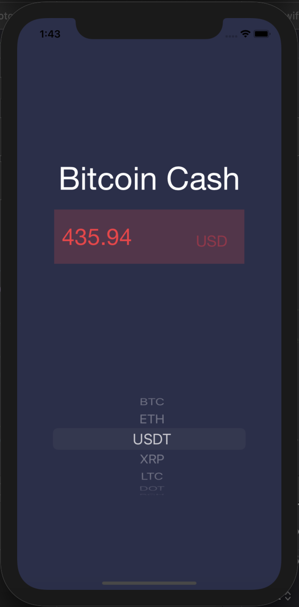

 

  

  <h2 align="center"></h2>
  <h3 align="center">Track the 10 most valuable cryptocurrencies in real time.</h4>

  

    iOS application that displays up-to-date value of cryptocurrencies. 
     
     
    <a href="https://github.com/MelissaAppel/Cryptocurrency-Tracker"><strong>Explore the docs »</strong></a>
     
  

<!-- TABLE OF CONTENTS -->

  
Table of Contents

  <ol>
    <li>
      <a href="#about-the-project">About The Project</a>
      <ul>
        <li><a href="#built-with">Built With</a></li>
      </ul>
    </li>
    <li>
      <a href="#getting-started">Getting Started</a>
      <ul>
        <li><a href="#prerequisites">Prerequisites</a></li>
        <li><a href="#installation">Installation</a></li>
      </ul>
    </li>
    <li><a href="#usage">Screenshots from App</a></li>
  </ol>

<!-- ABOUT THE PROJECT -->
## About The Project
An iOS application that helps users determine the current value of the world's most popular cryptocurrencies. Obtains JSON data from Coin.io, and displays the data on the user's screen.

Features:
* Bitcoin
* Ethereum
* Tether
* XRP
* Litecoin
* Polkadot
* Bitcoin Cash
* Cardano
* Binance Coin
* Chainlink

### Built With

* [Xcode](https://developer.apple.com/xcode/)
* [CoinApi.io](https://www.coinapi.io/)

<!-- GETTING STARTED -->
## Getting Started
Application can be used on iphones only. not currently published to app store, but can be deployed to simulators on phones in Xcode, or wirelessly on personal device through Xcode. 

### Prerequisites
For use on iOS devices running iOS 13.0 and higher. 

### Installation

1. Simulation build through Xcode required.

<!-- USAGE EXAMPLES -->
## Screenshots from App

